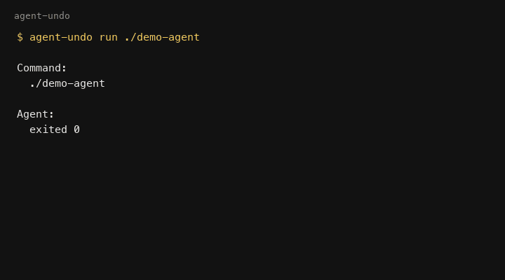

# Agent Undo

## Ctrl+Z for AI agents.

Checkpoint and restore a local terminal coding session with:

```text
agent-undo run <agent>
```

One checkpoint per session. One command to restore it.



```text
$ agent-undo run ./demo-agent

AGENT UNDO

Session:
  ABC3F9E9-3055E8A0

Command:
  ./demo-agent

Changes:
  +3 created
  ~3 modified
  -1 deleted

Undo:
  AVAILABLE

$ agent-undo undo --yes ABC3F9E9-3055E8A0
SUCCESS
recovery checkpoint: cp_7995a3c1c5c59c5b55f40682
```

Those lines are from the canonical demo fixture (`examples/setup-demo`), not a mock. Full transcript: [docs/demo-capture.txt](docs/demo-capture.txt). Counts are whatever `diff` measured that run.

### Install

macOS or Linux. Windows is unsupported in v0.1. There is no Homebrew formula and no `curl | sh` installer.

**Prebuilt binaries** will ship in the `v0.1.0` [release](https://github.com/luxavr/agent-undo/releases) when that tag exists. Until then, do not curl a `v0.1.0` download URL.

**Development / contributors** (Go 1.23+):

```bash
go install github.com/luxavr/agent-undo/cmd/agent-undo@main
```

Then, in the repository you intend to protect (not `$HOME` unless that directory is the workspace):

```bash
cd <your-repo>
agent-undo doctor
```

`doctor` prints `checking: /absolute/path` for the directory it inspects. After `v0.1.0`, the README will make the checksum-verified release binary the primary path and pin `go install` to `@v0.1.0`.

### Demo

The demo fixture lives in this repository. Clone it; do not expect a release asset to contain `examples/`.

```bash
git clone https://github.com/luxavr/agent-undo.git
cd agent-undo
demo=$(./examples/setup-demo)
./examples/setup-demo --check
cd "$demo"
agent-undo doctor
agent-undo run ./demo-agent
agent-undo undo --yes <session-id>
agent-undo verify <session-id>
```

Never run the demo against this source tree. `./demo-agent` refuses to run unless `.agent-undo-demo` is present. Default mutation is modify / create / delete. `--commit` and `--branch` are opt-in. After undo, `.agent-undo-demo` and `demo-agent` may remain untracked; that is correct.

### Run

```bash
agent-undo run claude
agent-undo run -- your-agent --flags
```

`run` takes a lock, writes a verified checkpoint, starts the command in its own process group, then prints a receipt. `run` and `session show` print the same receipt.

v0.1 is wrapper-based. Cursor/editor-native attachment is not supported.

### Undo

```bash
agent-undo undo --yes ABC3F9E9-3055E8A0
```

```text
SUCCESS
recovery checkpoint: cp_7995a3c1c5c59c5b55f40682
```

Undo always creates a recovery checkpoint before APPLY. To put the post-agent state back:

```bash
agent-undo recover [--yes]
agent-undo recover [--yes] cp_<id>
```

### Verify

```bash
agent-undo verify ABC3F9E9-3055E8A0
```

```text
SUCCESS
```

Also useful:

```bash
agent-undo session show <session-id>
agent-undo diff <session-id>
```

### How it works

1. Checkpoint supported local files and git metadata (HEAD + branch, when present).
2. Run the agent as a child process.
3. Record a final manifest and a file/state diff.
4. Print an honest receipt.
5. On undo: lock → load → validate → plan → **recovery checkpoint** → apply → verify.

The checkpoint is the source of truth. Git is one dimension of state, not the whole state.

Public contract: [docs/v0.1-contract.md](docs/v0.1-contract.md). Detailed annex: [docs/limitations.md](docs/limitations.md).

### What it restores

Supported local filesystem bytes inside the repository boundary, plus captured git HEAD/branch when the workspace was a git repo. Gitignored small files such as `.env.local` are included. See [docs/adr/0003-ignore-policy.md](docs/adr/0003-ignore-policy.md).

### What it does not restore

External side effects, cloud APIs, remote git, databases that were not checkpointed files, production infrastructure, git index/staging, `node_modules`-class trees, or anything outside the repository boundary. Agent Undo is not a sandbox.

Full list: [docs/limitations.md](docs/limitations.md).

### Supported platforms

macOS and Linux (`darwin`/`linux` × `amd64`/`arm64` release assets). Windows is unsupported in v0.1. CI executes tests on `ubuntu-latest` and `macos-latest`; other release targets are cross-compiled, not executed.

### Security

Runs as the user. Paths are canonicalized inside one repository boundary. Symlinks are stored as links and are not followed out of the boundary. Destructive restore never starts without a verified recovery checkpoint.

[docs/security-model.md](docs/security-model.md)

### Architecture

[docs/architecture.md](docs/architecture.md) · [docs/adr/0002-git-restore-policy.md](docs/adr/0002-git-restore-policy.md) · [docs/adr/0004-session-state.md](docs/adr/0004-session-state.md)

Commands: `run`, `session list`, `session show`, `undo`, `verify`, `diff`, `recover`, `doctor`.

### Development

From a checkout. Go 1.23+. Untagged binaries report `0.0.0-dev`.

```bash
go build -o bin/agent-undo ./cmd/agent-undo
go test ./...
go test -race ./...
go vet ./...
```

`go install` until `v0.1.0` is documented under Install. GOPATH troubleshooting is in [CONTRIBUTING.md](CONTRIBUTING.md). CI: Ubuntu and macOS. Feature freeze: v0.1. Do not add Batch 8 subsystems. Report issues with the GitHub templates. Data-safety and restore-correctness outrank stars.

### Contributing

See [CONTRIBUTING.md](CONTRIBUTING.md). Launch gate: [docs/v0.1-contract.md](docs/v0.1-contract.md), [docs/prelaunch-audit.md](docs/prelaunch-audit.md).
